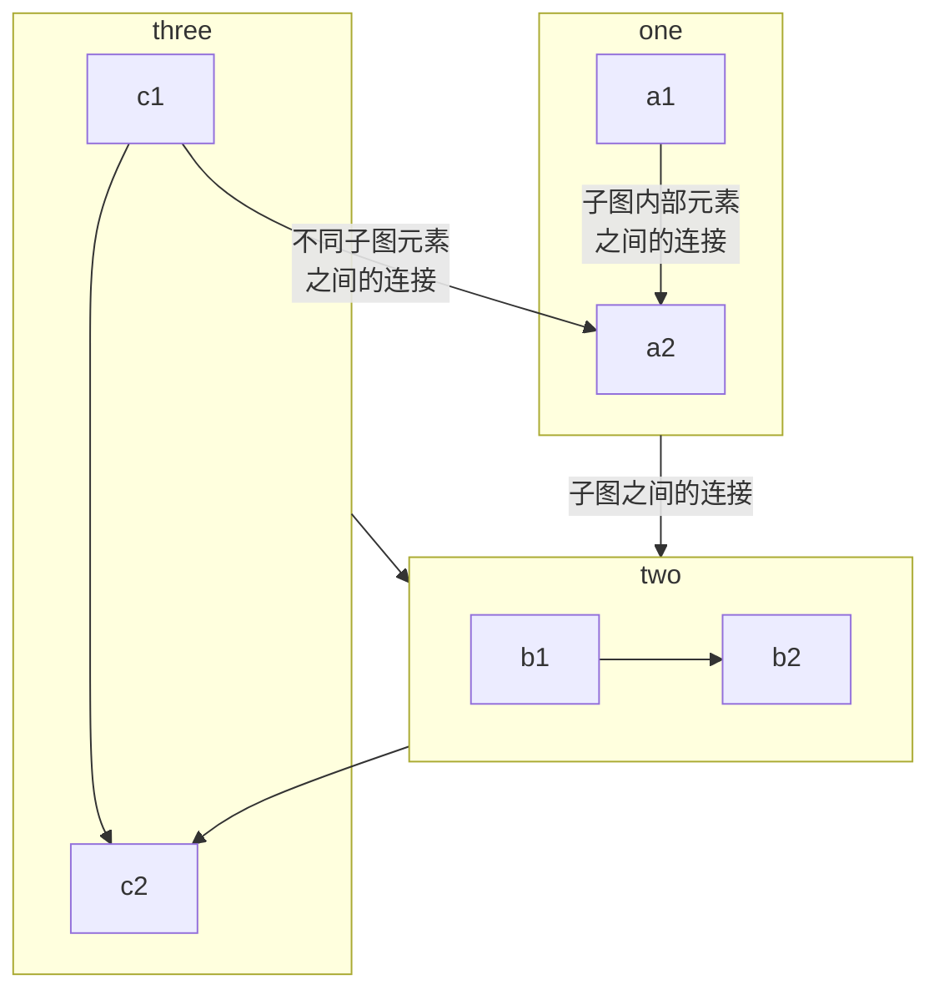

# LA的个人开发日志

## 开发日志

+ 封装模型到高层实现根据剪枝率自由调整卷积核数

## 待测试

| model     | lr  | epoch | scheduler       | optim   | ok  |
|-----------|-----|-------|-----------------|---------|-----|
| mobilenet | 0.1 | 160   | reduce_lr       | sgd     | T   |
| mobilenet | 0.1 | 160   | reduce_lr       | sgd_pfl | T   |
| resnet110 | 0.1 | 400   | warm_up_step_lr | sgd_pfl | F   |
| resnet110 | 0.1 | 400   | warm_up_step_lr | sgd     | F   |
| mobilenet | 0.1 | 160   | cosine_lr       | sgd_pfl | T   |

### 待实现

+ vhrank：load_params()加载所有参数，并非只有卷积层权重

## 待优化

1. runtimeEnv和preEnv需要进一步整合区分
3. 添加注释，修改命名合乎规范，内部类前缀_
4. 封装test_unit.py接口
5. 重新梳理各个模块的耦合，封装易用的抽象类
6. 内外部类及接口区分出来

## 难点

+ 剪枝参数的确定，是一个超参数
+ 为什么要判断learning rate一样
+ 怎样保证master节点和worker节点上的模型都收敛

## 需求

+ 给定一个损失精度-5%，然后求得最小网络子结构，获得网络中各卷积层的通道数

## 未来的工作

+ rank_plus中的超参数确定，或者测试合适的
+ interval中的超参数确定，或者测试合适的
+ 实现ResNet、MobileNet在ImageNet上的效果
+ 实现真实网络交互通信，套接字实现

## 博客对项目进行说明
### 快速熟悉项目进行二次开发
#### 架构

